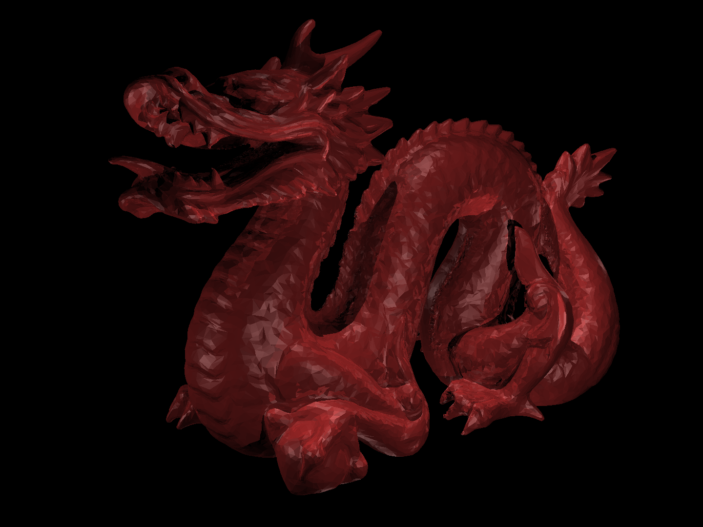

## UCSD CSE 168x, Computer Graphics II
### Ray Tracing with NVIDIA OptiX
#### 12/27/2020 ray-tracer-0.1
- Implemented simple ray tracer with Optix 6.5 and CUDA 10.0
- See INSTALL-LINUX/WIN.txt for compile instruction
- Used native GeometryTriangles and self-defined Sphere for geometry primitives  
# dragon-1 