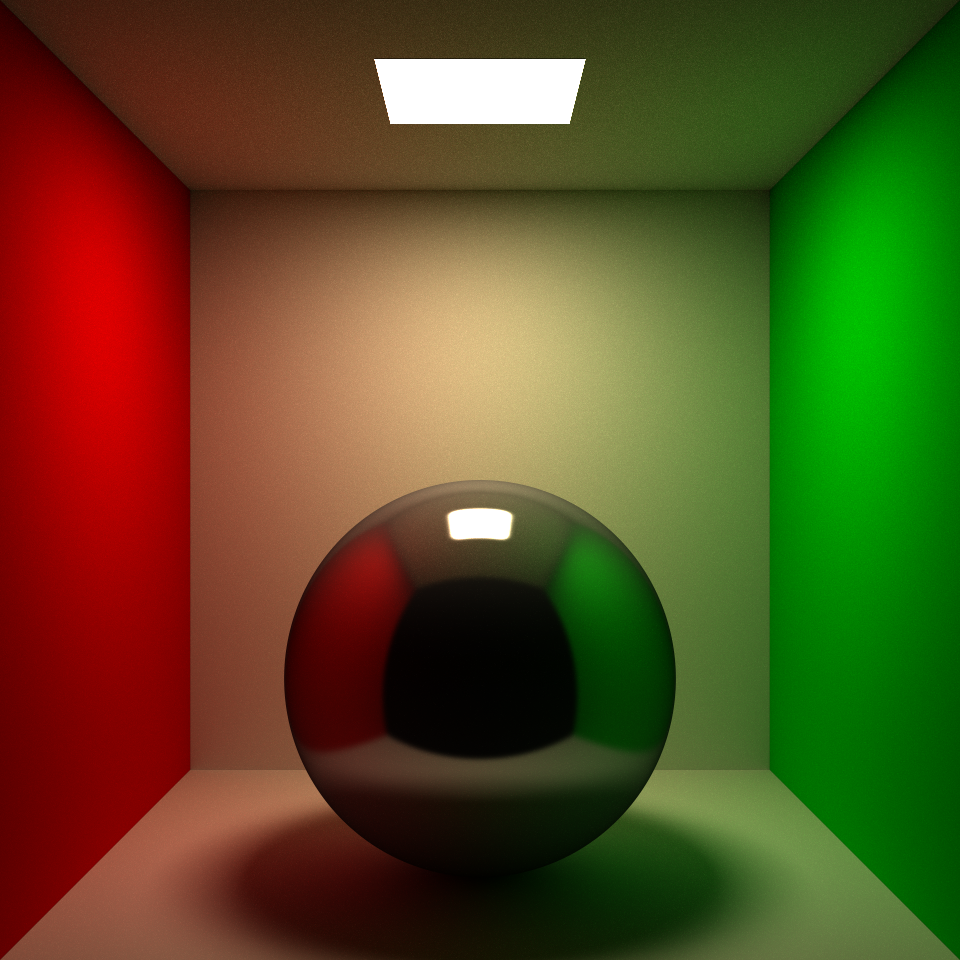

## UCSD CSE 168x, Computer Graphics II
### Ray Tracing and Path Tracing with NVIDIA OptiX

#### 12/27/2020 ray-tracer
- Implemented simple ray tracer with NVIDIA OptiX
- See INSTALL-LINUX/WIN.txt for compile instructions
- Tested version:  
Windows 10: CUDA 10, OptiX 6.5;
Ubuntu 20.04: CUDA 10.2, OptiX 6.5
- Used native GeometryTriangles and self-defined Sphere for geometry primitives
- Blinn–Phong shading model, recursive trace for mirror reflection  

  
  
 
  
  
 

#### 12/29/2020 path-tracer-light
- Solve render equation for direct area lighting
- Modified Phong BRDF
- Monte Carlo integration with stratified sampling

  
  
 
  
  
 
  
  
  
  
 
  
  
 
  
  
  
  
 
  
  
 
  
  

#### 12/30/2020 monte-carlo-path-tracer   

  

- Monte Carlo Path Tracer
1. Brute Force approach 
2. Next event emission
3. Russian roulette
- TODO: Importance Sampling BRDF
- TODO: Realistic material model

