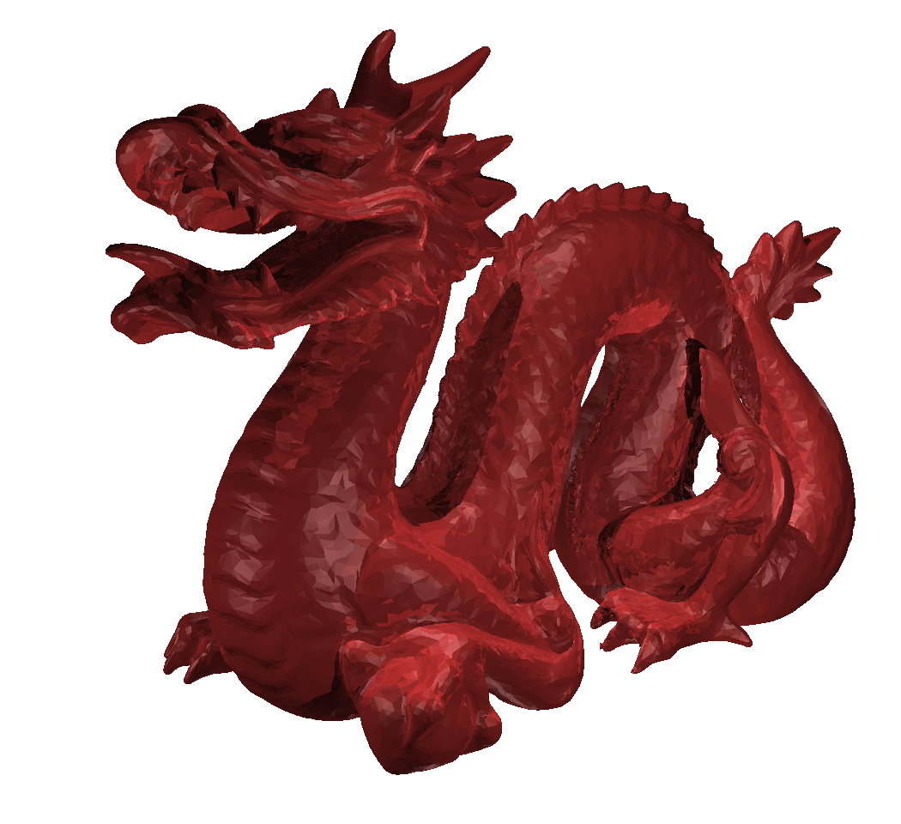

## UCSD CSE 168x, Computer Graphics II
### Ray Tracing and Path Tracing with NVIDIA OptiX

#### 12/27/2020 ray-tracer-0.1
- Implemented simple ray tracer with NVIDIA OptiX
- See INSTALL-LINUX/WIN.txt for compile instructions
- Tested version:  
Windows 10: CUDA 10, OptiX 6.5;
Ubuntu 20.04: CUDA 10.2, OptiX 6.5
- Used native GeometryTriangles and self-defined Sphere for geometry primitives
- Blinn–Phong shading model, recursive trace for mirror reflection
